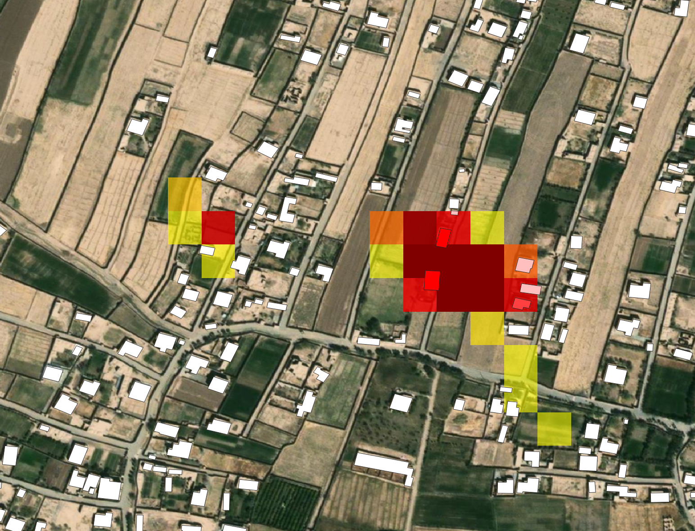

# Damage proxy map workflow

The purpose of this workflow is to provide a step-by-step guide for how to use a damage proxy map (DPM) to perform a building damage assessment. Damage proxy maps are created from pairs or triplets of SAR scenes captured before and after an event. They measure the change in coherence caused by the event and, when constrained over buildings, can give a good estimate of the damage to each building. For more information on this approach see [Tay et al. 2020 in Scientific Data](https://www.nature.com/articles/s41597-020-0443-5).


## 1. Download a damage proxy map
There are several organizations that release damage proxy maps after disasters, see the following websites for lists of available data:
- [NASA JPL's Advanced Rapid Imaging and Analysis project](https://aria-share.jpl.nasa.gov/)
- [Earth Observatory of Singapore](https://eos-rs-products.earthobservatory.sg/)

For this tutorial we will use the DPM released by the Earth Observatory of Singapore (EOS) for the October 2023 earthquakes in Afghanistan:
```
mkdir -p data/demo_dpm/
cd data/demo_dpm/
wget "https://eos-rs-products.s3-ap-southeast-1.amazonaws.com/EOS-RS_202310_Afghanistan_Earthquake/EOS-RS_20231013_DPM_A2_Afghanistan_Earthquake_v0.5.tif"
cd ../../
```

As the EOS DPMs are color mapped, we have an accessory script to reverse the colormapping:
```
python scripts/convert_colormapped_dpm_to_raw.py --input_fn data/demo_dpm/EOS-RS_20231013_DPM_A2_Afghanistan_Earthquake_v0.5.tif --output_fn data/demo_dpm/EOS-RS_20231013_DPM_A2_Afghanistan_Earthquake_v0.5_raw.tif
```

## 2. Download building footprints
To summarize DPM values at the building level, we can download building footprints from OSM, Google, or Microsoft using the `download_building_footprints.py` command:
```
python download_building_footprints.py --source microsoft --input_fn data/demo_dpm/EOS-RS_20231013_DPM_A2_Afghanistan_Earthquake_v0.5_raw.tif --output_dir data/demo_dpm/ --country_alpha2_iso_code AF
```

## 3. Summarize DPM values at the building level
Finally, we can summarize the average DPM values at the building level using the `dpm_intersection.py` command:
```
python dpm_intersection.py --input_dpm_fn data/demo_dpm/EOS-RS_20231013_DPM_A2_Afghanistan_Earthquake_v0.5_raw.tif --input_buildings_fn data/demo_dpm/AF_microsoft_buildings_footprints.gpkg --output_fn data/demo_dpm/AF_microsoft_buildings_footprints_with_avg_dpm.gpkg
```

This will make a copy of the buildings footprints file with an additional column called `average_dpm` that contains the average DPM value for each building. We can choose a threshold value to classify which buildings are damaged and which are not based on inspecting post-disaster optical imagery that is in the AOI of the DPM. For example, if we want to choose a threshold of 0.5, then we can run:
```
python dpm_intersection.py --input_dpm_fn data/demo_dpm/EOS-RS_20231013_DPM_A2_Afghanistan_Earthquake_v0.5_raw.tif --input_buildings_fn data/demo_dpm/AF_microsoft_buildings_footprints.gpkg --output_fn data/demo_dpm/AF_microsoft_buildings_footprints_with_damage.gpkg --threshold 0.5
```

This will compute `average_dpm` like before, but include another column called `damaged` that is 1 where `average_dpm` is greater than the threshold value and 0 otherwise.

The figure below shows the result of this workflow:
