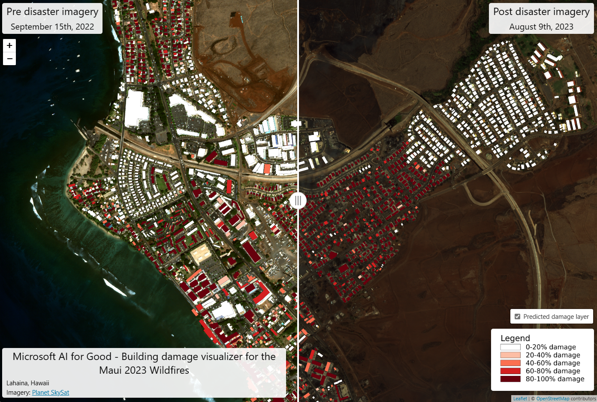

# A building damage assessment toolkit

**Jump to: [Setup](#setup) | [Satellite imagery assessment workflow](#satellite-imagery-damage-assessment-workflow) | [Damage proxy map workflow](#damage-proxy-map-analysis-workflow) | [Results](#results)**


Remotely sensed data (e.g. satellite imagery, aerial imagery, or synthetic apeture radar data) can be used to assess the extent of damage to buildings and infrastructure after a natural disaster. First responders and humanitarian organizations use assessments of damage to buildings and infrastructure to prioritize their response efforts -- both in terms of where to send resources and how many resources to send. This repository is designed to act as a well documented "toolkit" that a data or research scientist can use to help perform building damage assessments from remotely sensed data in several ways.

First, we provide a workflow to fine-tune a building damage assessment model in an end-to-end fashion, described more in [Satellite Imagery Analysis Workflow](#satellite-imagery-damage-assessment-workflow). This includes a labeling tool that can be used to generate annotations given the imagery, scripts for creating segmentation masks from the annotations, and scripts for fine-tuning a model and performing inference. We've used this workflow in several disaster events to date, including the [2023 Turkey/Syria Earthquakes](https://www.microsoft.com/en-us/research/uploads/prod/2023/02/Turkey-Earthquake-Report-2_MS.pdf) and the [2023 tornadoes in Rolling Fork, Mississippi](https://arxiv.org/abs/2306.12589).

Second, we provide tools to analyze "Damage Proxy Maps", or DPMs, described more in [Damage Proxy Map Workflow](#damage-proxy-map-analysis-workflow). DPMs are generated from pre- and post-disaster SAR data by organizations such as [NASA JPL's Advanced Rapid Imaging and Analysis project](https://aria.jpl.nasa.gov/) and [Earth Observatory of Singapore](https://earthobservatory.sg/). These data products estimate damaged areas by measure the change in coherence between SAR scenes. For more information on this approach see [Tay et al. 2020 in Scientific Data](https://www.nature.com/articles/s41597-020-0443-5). We provide scripts to intersect DPMs with building footprints and summarize the results at different levels of aggregation.


<p align="center">
    <br/>
    <b>Figure 1.</b> Example of visualizer showing the result of the building damage assessment workflow after the Maui wildfires in August, 2023.
</p>


## Setup

Clone this repo and install the conda environment:
```
conda env create -f environment.yml
conda activate bda
```


## Satellite imagery damage assessment workflow

A tutorial that walks through how to perform a damage assessment step-by-step with imagery from Maxar's Open Data program can be found [here](SATELLITE_WORKFLOW.md).


## Damage proxy map analysis workflow

A tutorial that walks through how to perform a damage assessment using a damage proxy map can be found [here](DPM_WORKFLOW.md).


## Results

The Microsoft AI for Good Lab has used this workflow to help our partners respond to a number of disasters. Including:
- The Turkey/Syria Earthquakes in March, 2023 ([report](https://www.microsoft.com/en-us/research/uploads/prod/2023/02/Turkey-Earthquake-Report-2_MS.pdf))
- The tornadoes in Rolling Fork, Mississippi in April, 2023 ([paper](https://arxiv.org/abs/2306.12589))
- The Maui wildfires in August, 2023 ([visualizer](https://aka.ms/lahaina_damage))
- The Morocco Earthquake in September, 2023
- The flooding in Libya in September, 2023 ([visualizer](https://aka.ms/libya_derna_flooding_2023))


## Contributing

This project welcomes contributions and suggestions.  Most contributions require you to agree to a
Contributor License Agreement (CLA) declaring that you have the right to, and actually do, grant us
the rights to use your contribution. For details, visit https://cla.opensource.microsoft.com.

When you submit a pull request, a CLA bot will automatically determine whether you need to provide
a CLA and decorate the PR appropriately (e.g., status check, comment). Simply follow the instructions
provided by the bot. You will only need to do this once across all repos using our CLA.

This project has adopted the [Microsoft Open Source Code of Conduct](https://opensource.microsoft.com/codeofconduct/).
For more information see the [Code of Conduct FAQ](https://opensource.microsoft.com/codeofconduct/faq/) or
contact [opencode@microsoft.com](mailto:opencode@microsoft.com) with any additional questions or comments.

## Trademarks

This project may contain trademarks or logos for projects, products, or services. Authorized use of Microsoft 
trademarks or logos is subject to and must follow 
[Microsoft's Trademark & Brand Guidelines](https://www.microsoft.com/en-us/legal/intellectualproperty/trademarks/usage/general).
Use of Microsoft trademarks or logos in modified versions of this project must not cause confusion or imply Microsoft sponsorship.
Any use of third-party trademarks or logos are subject to those third-party's policies.

## License

This project is licensed under the [MIT License](LICENSE).