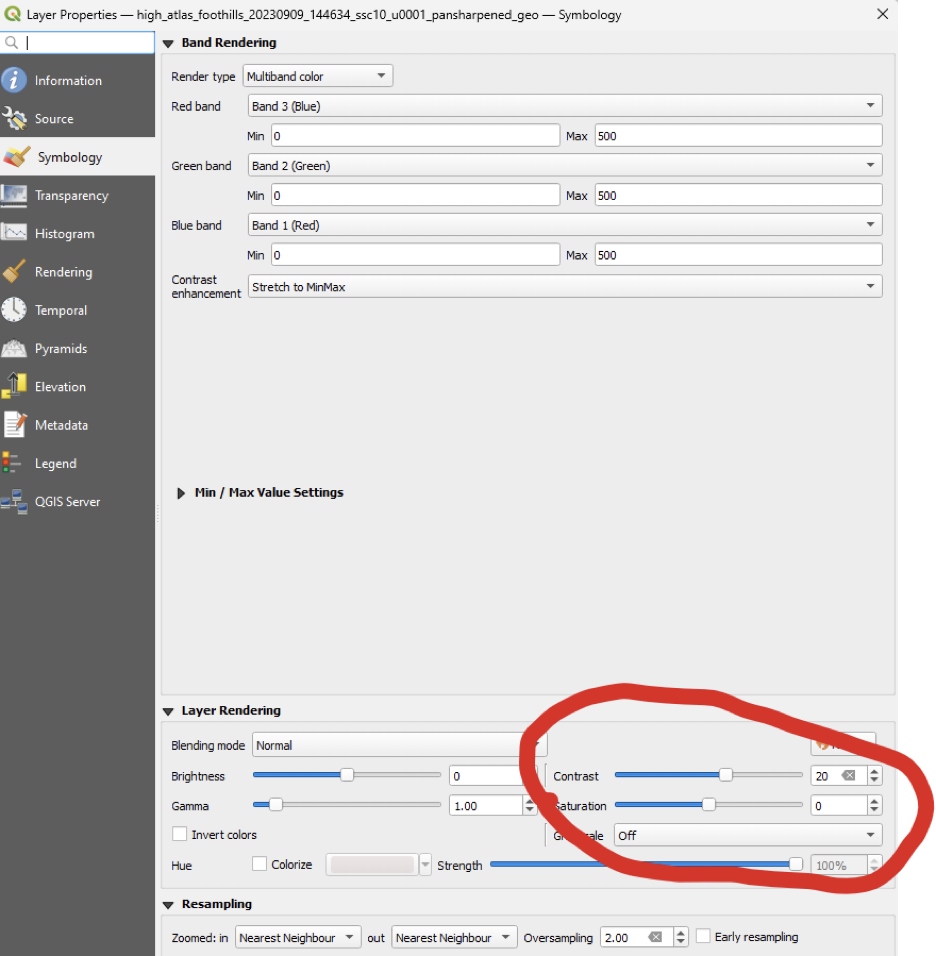
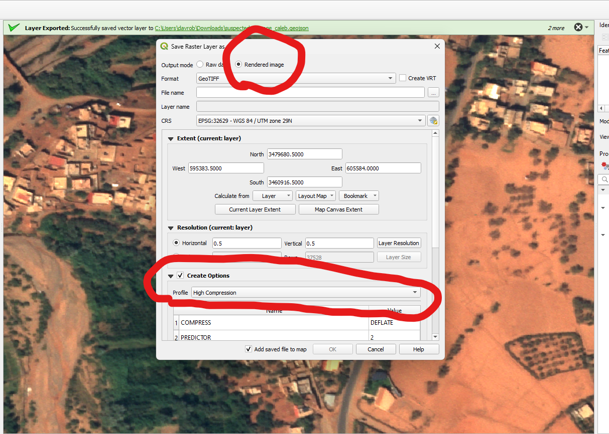
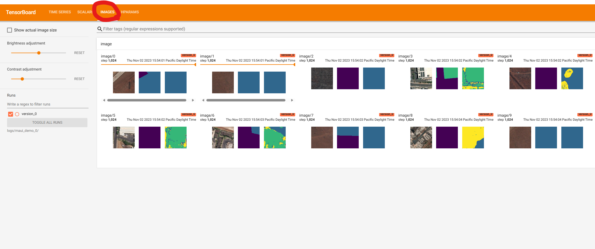
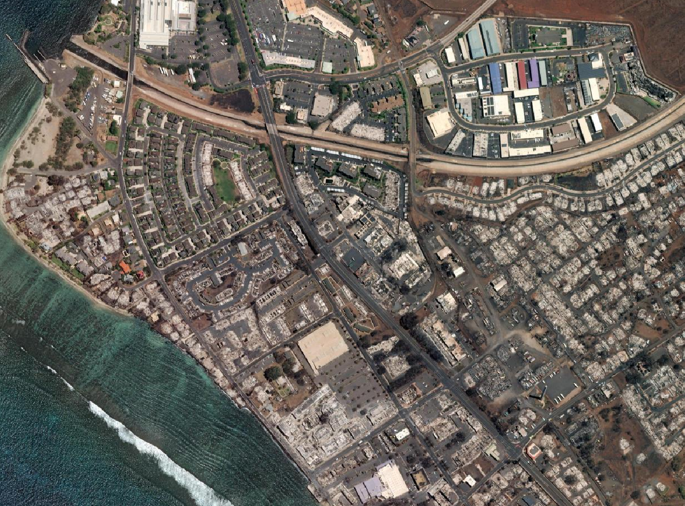
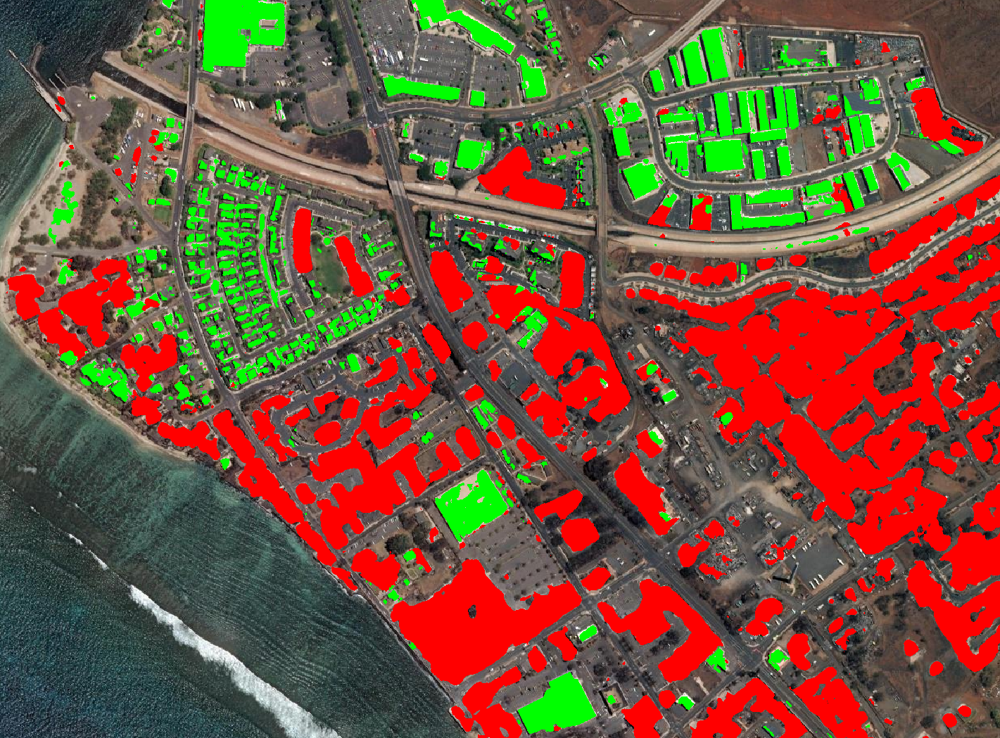
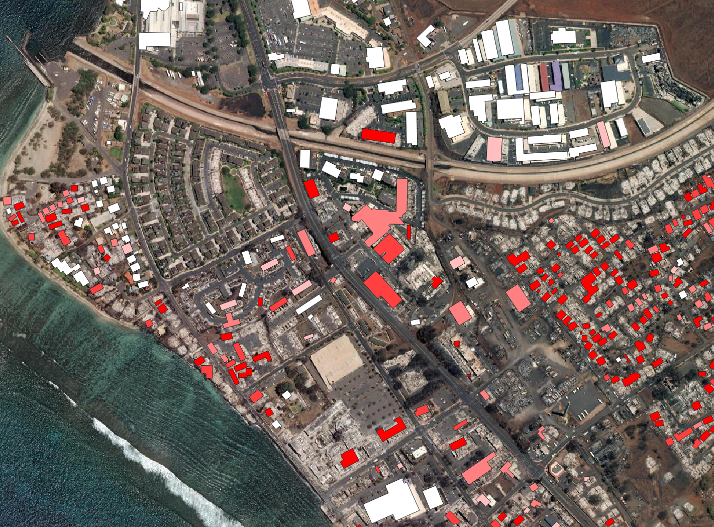

# Satellite imagery damage assessment workflow

The purpose of this workflow is, given post-disaster imagery of some area of interest (AOI), to identify whether each known building footprint in the AOI is damaged, and to what extent it is damaged, as quickly as possible.
The approach that we take is to fine-tune a pre-trained semantic segmentation model on a small amount of labeled data collected in the AOI itself. The model is then used to generate per-pixel prediction over the entire imagery, which can then be summarized at the building level.

The workflow consists of three parts described in the following sections:
1) [Image acquisition and label generation](#1-image-acquisition-and-label-generation)
2) [Model training and inference](#2-model-training-and-inference)
3) [Results summarization](#3-results-summarization)


## 1. Image acquisition and label generation
Post disaster imagery may be available through different image providers, e.g. Sentinel-2, Planet, Maxar, or NOAA.

For the purposes of this tutorial we will use satellite imagery from [Maxar's Open Data program](https://www.maxar.com/open-data/) for the [Maui wildfires in August, 2023](https://radiantearth.github.io/stac-browser/#/external/maxar-opendata.s3.amazonaws.com/events/Maui-Hawaii-fires-Aug-23/collection.json). The following commands download the imagery captured over Lahaina on 8/12/2023, and merges the files into a single cloud optimized GeoTIFF (COG).

```
mkdir -p data/demo/raw/
cd data/demo/raw/
wget https://maxar-opendata.s3.amazonaws.com/events/Maui-Hawaii-fires-Aug-23/ard/04/122000330002/2023-08-12/10300100EB15FF00-visual.tif
wget https://maxar-opendata.s3.amazonaws.com/events/Maui-Hawaii-fires-Aug-23/ard/04/122000330020/2023-08-12/10300100EB15FF00-visual.tif
gdalbuildvrt maxar_lahaina_8_12_2023-visual.vrt *.tif*
gdalwarp -co BIGTIFF=YES -co NUM_THREADS=ALL_CPUS -co COMPRESS=LZW -co PREDICTOR=2 -of COG maxar_lahaina_8_12_2023-visual.vrt maxar_lahaina_8_12_2023-visual.tif
rm 10300100EB15FF00-visual.tif*
rm maxar_lahaina_8_12_2023-visual.vrt
cd  ../../..
```
_Tip:_ Download the resulting GeoTIFF file to your laptop, and view it in QGIS to make sure it is what you expect.


### Step 1.1

The first step (after acquiring imagery of course!) is to create a configuration file based off of the `configs/example_config.yml` file. This file will contain all the arguments needed throughout the workflow including: a path to the imagery, what class labels to use, training parameters, and more. The first three sections of the config file should be filled out before running `project_setup.py`:
- **experiment_name** and **experiment_dir**: These define the "name" of the current run and the directory where all the outputs will be saved
- **infrastructure**: The labeling workflow requires a TiTiler server to dynamically generated XYZ tiles from the imagery, and a Azure Blob Storage account to host the imagery
- **imagery**: The path to and normalization details of imagery that will be used for training and inference
- **labels**: The path to the GeoJSON labels that will be used for training, what class labels are used, and how to buffer the labels
- **training**: The training parameters for the model
- **inference**: The inference parameters for the model

After filling out the first three sections of the config file, run the following command to generate the experiment directory structure and a link to the labeling tool:
```
python project_setup.py --config configs/example_config.yml
```


If a TiTiler deployment isn't feasible then tiles in [XYZ tile format](https://developers.planet.com/docs/planetschool/xyz-tiles-and-slippy-maps/) can be pre-rendered with the [gdal2tiles.py](https://gdal.org/programs/gdal2tiles.html) command.


### Step 1.2
`project_setup.py` should create a link to a [satellite-imagery-labeling-tool](https://github.com/microsoft/satellite-imagery-labeling-tool/) instance with the post-disaster imagery visible. There is detailed documentation on how to setup and use the annotation tool [here](https://github.com/microsoft/satellite-imagery-labeling-tool/tree/main/docs). The next step is to create annotations using this tool, download those annotations, and save in the location pointed to be `labels.fn` in the config file.

### Tips and tricks

#### How to label effectively
Through trial-and-error we have found that the following strategies result in effective labels:
- Labeling features with high preicision is more important than rapidly labeling large areas with low precision
- Do not label a feature that you are uncertain about
- Label features that are directly adjacent to each other. For example, if you are labeling a building, then label the background area around it as well. This is important because unlabeled areas are not used in training the model, therefore if you label a building, but do not label around it, then model will not be penalized for making a large blurry prediction around the building (vs. a precise prediction that follows the lines of the building).
- Label diverse features. For example, labeling 20 identical looking buildings is not particularly useful to the model training.
- When labeling damage, only label the damaged parts of buildings. I.e. label the pixels that you want the model to identify as "damaged" and nothing else.

#### Downloading imagery from Maxar's Open Data Program
Run the command below to browse disasters event names with Maxar imagery available on AWS:
```
aws s3 ls --no-sign-request s3://maxar-opendata/events/{EVENT_NAME}/ard
```

To download all imagery for a specific event use the following commands:
```
aws s3 cp --no-sign-request --recursive s3://maxar-opendata/events/{EVENT_NAME}/ard/ .
```

All events in Maxar's catalogue can be viewed using the following command:
```
aws s3 ls --no-sign-request s3://maxar-opendata/events/
```

#### Collate groups of imagery into COGs
Some imagery will be distributed as groups of tiles. You can merge smaller images into a single large COG using the following commands:
```
gdalbuildvrt {VRT_NAME}.vrt  {DOWNLOADED_IMAGERY}/*.tif

gdalwarp -co BIGTIFF=YES -co NUM_THREADS=ALL_CPUS -co COMPRESS=LZW -co PREDICTOR=2 -of COG {VRT_NAME}.vrt {LARGE_COG_NAME}.tif
```

#### Prepare imagery for labelling
If your rendered RGB imagery has low contrast, then manual labeling can be difficult to impossible. You can use QGIS to play around with different normalization and contrast settings as shown in the following figure:



You can save the contrast adjusted image as a rendered GeoTIFF by right clicking the layer in the Layers panel, then exporting, and selecting the "Rendered image" option as shown in the following figure (remember to set the compression level to high here):




## 2. Model training and inference

The model training and inference steps are based on config files. If you opted to skip the previous step, we have provided example labels for the demo in `data/demo/labels/` and a default config file that uses these labels in `configs/example_config.yml`. After setting up the config file, the following commands will create masks from the GeoJSON labels, fine-tune a model using the imagery and masks, and run inference with that model over the entire scene:
```
python create_masks.py --config configs/example_config.yml
python fine_tune.py --config configs/example_config.yml
python inference.py --config configs/example_config.yml
```

**OR**, more simply:
```
python run_workflow.py --config configs/example_config.yml
```


More specifically, the `create_masks.py` script will create a new directory in based on the **experiment_dir** key in the config file, with the training images in `images/`, the rasterized version of the labels in `masks/`, and a copy of the original labels in `labels/`. Next, the `fine_tune.py` script will use the `images/` and `masks/` directory to fine-tune a semantic segmentation model, saving model checkpoints in `checkpoints/` and TensorBoard logs to the directory specified by the **training.log_dir** key in the config file. Finally, `inference.py` will create predictions over the entire input image (using the latest model checkpoint) and save the results to the `outputs/` directory.

### Label Clustering

When labels are sparse across a large imagery scene, most of the mask will be nodata, meaning that some training batches will have all 0s. To improve training efficiency, `create_masks.py` supports clustering labels into spatial grid cells and creating separate image/mask pairs for each cluster. This can be enabled by adding the following parameters to the `labels` section of your config file:

```yaml
labels:
  # ... existing parameters ...
  cluster_size_in_meters: 1000  # Size of grid cells in meters for clustering labels
  min_pixels_per_cluster: 1000  # Minimum number of labeled pixels required per cluster
```

When clustering is enabled:
- Labels are divided into grid cells of the specified size
- A separate image/mask pair is created for each grid cell that contains labels
- Clusters with fewer than `min_pixels_per_cluster` labeled pixels are discarded
- Output files are named with a `_cluster_{i}` suffix (e.g., `image_cluster_0_cropped.tif`)

An example config with clustering enabled can be found in `configs/example_config_clustered.yml`.

You can use tensorboard to monitor training:
```
tensorboard --logdir logs/maui_demo_0/ --port 8889
```

In particular, the "Images" tab in tensorboard will show examples of the input imagery, target mask, and model predictions. See the following figure for an example:


If, after 20-30 epochs of training, the model results do not look reasonable, then we advise labeling more examples of the three classes (taking into account the mistakes that the model is making), creating a copy of the config file pointing to the updated GeoJSON, and re-running the `create_masks.py`, `fine_tune.py`, and `inference.py` scripts. It is also helpful to intermittently run inference with the latest checkpoint while the model is training to see if the results are useful.

The following figures show imagery and the resulting predictions after 8 epochs of training with the example labels (green is the "Building" class and red is the "Damaged Building" class):





## 3. Results summarization
To summarize results at the building level, download building footprints from OSM, Google, or Microsoft using the `download_building_footprints.py` command, for example:

```
python download_building_footprints.py --source microsoft --input_fn data/demo/raw/maxar_lahaina_8_12_2023-visual.tif --output_dir data/demo/buildings/ --country_alpha2_iso_code US
```

Merge inference results with downloaded building footprints with the following command:

```
python merge_with_building_footprints.py --footprints_fn data/demo/buildings/US_microsoft_buildings_footprints.gpkg --predictions_fn experiments/maui_demo_0/outputs/maxar_lahaina_8_12_2023-visual_predictions.tif --output_fn experiments/maui_demo_0/outputs/maxar_lahaina_8_12_2023-visual_predictions.gpkg
```

This will calculate the percentage of each building that is predicted to be damaged and save the results as a geopackage.

The final output looks like this:


